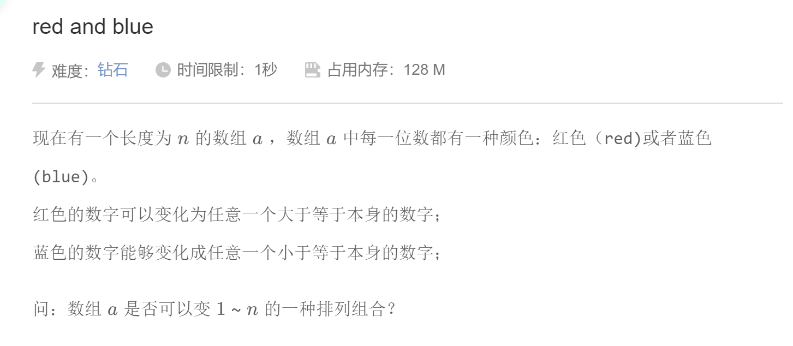

## 离散化

```c++
vector< int > alls; // 存储所有待离散化的值
sort(alls.begin(), alls.end()); // 将所有值排序
alls.erase(unique(alls.begin(), alls.end()), alls.end());   // 去掉重复元素
// 二分求出x对应的离散化的值（用lower_bound更简单）
int find(int x) // 找到第一个大于等于x的位置
{
    int l = 0, r = alls.size() - 1;
    while (l < r)
    {
        int mid = l + r >> 1;
        if (alls[mid] >= x) r = mid;
        else l = mid + 1;
    }
    return r + 1; // 映射到1, 2, ...n
}

```

## 字符串分割函数

```c++
vector<string> split(string& s, char c){
    vector<string> tokens;
    size_t start=0,end=0;
    while(s.find(c,start)!=string::npos){
        end=s.find(c,start);
        tokens.emplace_back(s.substr(start,end-start));
        start=end+1;
    }
    tokens.emplace_back(s.substr(start));
    return tokens;
}
//find()也可以查找string
```


## 异位词

```c++
//找到所有异位词

class Solution {
public:
    vector<vector<string>> groupAnagrams(vector<string>& strs) {
        unordered_map<string, vector<string>> mp;
        for (string& str: strs) {
            string key = str;
            sort(key.begin(), key.end());
            mp[key].emplace_back(str);
        }
        vector<vector<string>> ans;
        for (auto it = mp.begin(); it != mp.end(); ++it) {
            ans.emplace_back(it->second);
        }
        return ans;
    }
};

//先排序，然后利用哈希映射

class Solution {
public:
    vector<vector<string>> groupAnagrams(vector<string>& strs) {
        vector<vector<string>> res;
        unordered_map <double,vector<string> > m;
        double a[26]={2,3,5,7,11,13,17,19,23,29,31,37,41,43,47,53,59,61,67,71,73,79,83,89,97,101};
        for(string& s : strs)
        {
            double t = 1;
            for(char c : s)
                t *= a[c - 'a'];
            m[t].push_back(s);          //t为单词对应的质数乘积，m[t]则为该单词的异位词构成的vector
        }
        for(auto& n : m)                //n为键和值组成的pair
            res.push_back(n.second);
        return res;
    }
};

//也可以利用质数相乘的结果作为26个字母的哈希映射
```

## 二分答案


## 组合总和

dfs回溯+剪枝


```c++
class Solution {
public:
    vector<vector<int>> res;
    void dfs(int k, int target, int ans, vector<int>& candidates, vector<int>& combine){
        if(k==candidates.size()){
            return;
        }
        if(ans==target){
            res.emplace_back(combine);
            return;
        }
        dfs(k+1,target,ans,candidates,combine); //不选直接跳过
        if(ans+candidates[k]<=target){
            combine.emplace_back(candidates[k]);
            dfs(k,target,ans+candidates[k],candidates,combine); //选择当前元素
            combine.pop_back();
        }
    }
    vector<vector<int>> combinationSum(vector<int>& candidates, int target) {
        vector<int> combine;
        dfs(0,target,0,candidates,combine);
        return res;
    }
};
```

## 贪心



贪心策略：先按照字母排序，如BBBBBRRR，再在同一类字母中数字从小到大排序

```c++
struct Node{
    int a;
    char c;
};

bool cmp(Node x,Node y){
    if(x.c==y.c){
        return x.a<y.a;
    }
    else{
        return x.c<y.c;
    }
}
```


贪心策略：对每一组数据求sum，按照sum从大到小排序，减法选择sum大的数据中大的值，加法选择sum小的数据中小的值

```c++
struct CARD {
    int a, b, sum;
} c[N];

bool cmp(CARD a, CARD b) { return a.sum > b.sum; }
```

## 小根堆


小根堆重载的是大于号，最后按p排序结果为：2、5、8、9...

用于反悔贪心


把a[i]和a[i+1]+a[i-1]-a[i]同时存入大根堆中，用于反悔

## 数组删除


## 逆序对


每个格子内的数字先减去门票费t，再求前缀和，那么只需要找出一段连续区间，其和大于等于0即可；

对于一个序列，如果存在i<j，使得a[i]>a[j]，则称之为逆序对；

在本题中，考察前缀和数组，如果存在i<j，使得a[i]<=a[j]，则满足要求，故所求结果为非逆序对；

求逆序对方法，归并排序：

```c++
void merge_sort(int l, int r, long long *a) {
    if (l >= r) {
        return;
    }
    int mid = (l + r) / 2;
    merge_sort(l, mid, a);
    merge_sort(mid + 1, r, a);
    int i = l, j = mid + 1, t = 0;
    while (i <= mid && j <= r) {
        if (a[i] > a[j]) {
            q[t++] = a[j++];  //q为临时答案数组,升序排列
            ans += mid - i + 1;  
            //对于a[j]，因为左半部分数组是递增有序的，所以左半部分剩余元素均大于a[j]，均可构成逆序对
            ans %= MOD;
        } else {
            q[t++] = a[i++];
        }
    }
    while (i <= mid)q[t++] = a[i++];
    while (j <= r)q[t++] = a[j++];
    for(i=l,j=0;i<=r;i++,j++){
        a[i]=q[j];
    }
}

merge_sort(0, n, sum);
cout << (n*(n+1))/2-ans <<endl;  //本题求的是非逆序对，所以减去ans
```

## 树状数组

实现O(logn)查询前缀和，O(logn)对原数列的一个位置进行修改

lowbit(i)为二进制表示下最低位1和后面的0构成的数值，lowbit(i)=i&(-i)

与前缀和不同的是，树状数组的一个ⅰ位置存储的并不是前ⅰ个元素的和，而是从i开始，（包括）向前ⅰ的lowbit(i)个元素的和


```c++
//树状数组查询
int ask(int x){
	int sum = 0;
	for(int i=x;i>=1;i-=lowbit(i)){
		sum+=t[i];
	}
	return sum;
}
//若是需要查询一段区间 [l, r] 的和，使用 ask(r) - ask(l - 1) 即可

//树状数组更新
void update(int pos,int k)
{
	for(int i=pos;i<=n;i+=lowbit(i))
	sum[i]+=k;
}
```

## 树状数组求逆序对


```c++
	for (int i = 1;i <= n; i++) {
		add(a[i],1); // add为更新操作
		ans += sum(n) - sum(a[i]); // sum为区间查询求逆序对数
	}
```

在门票一题中，我们求的是非逆序对个数，并且还要保证如果只有一个元素大于0也满足条件，故我们可以按照上述方法求出逆序对，再单独考虑单一元素是否满足要求即可；

在add(a[i],1)中，因为a[i]对应的是树状数组的下标，故有可能出现数组下标越界的情况，所以需要对前缀和数组进行离散化，代码大致如下：

```c++
//vi为sum数组排序后的结果
for(long long i=1;i<=n;i++){
        sum[i]= lower_bound(vi.begin(),vi.end(),sum[i])-vi.begin()+1;
    }
```

## 单调栈


要输出最少海报数量，可以利用单调栈。一共最多使用n张海报，那么如何减少海报使用的数量呢？我们发现形如23453这样的建筑，可以减少一张海报数量，但是形如5352这样的建筑，就无法减少海报数量。故我们可以得出，当使用单调递增栈时，如果弹栈时出现了相同元素，就可减少一张海报。最后答案为n-ans。

## 多项式求值

首先，对负数取模时，采用如下公式：
$$
ans=(ans\%MOD+MOD)\%MOD
$$
对多项式变形：
$$
P(X)=a_n*x^n+a_{n-1}*x^{n-1}+...+a_1*x_1+a_0
$$

$$
P(X)=(((a_n*x+a_{n-1})*x+a_{n-2})*x...+a_1)*x+a_0
$$

最终求和代码为：

```c++
    ans=a[1];
    for(int i=2;i<=n;i++){
        ans=ans*x+a[i];
        ans=(ans%MOD+MOD)%MOD;
    }
```

这样避免了pow()使用浮点运算造成的精度问题

## 差分

原数组 A，差分数组 B，B[1] = A[1] ；B[i] = A[i] - A[i-1]；

**B 数组前缀和 ⇔ A 数组元素值**

SUM{B[1~i]} = A[i]

**A 数组的区间加 ⇔ B 数组的单点修改**

A[L]~A[R] 均加上 c 等价于 B[L] += c, B[R+1] -= c


除去第一个元素，假设差分数组为2，2，-1，-2，每次操作可以对其中一个位置+c，另一个位置-c，那么我们要求的最终结果就是所有正数之和与所有负数之和相比，绝对值较大的数

## 最大子矩形面积

在柱状图中，求最大矩形面积时，我们只需要使用两遍单调栈，对每个i求出a[i]左右第一个小于其的位置，然后计算矩形面积即可；

在矩阵中，我们则需要求n遍单调栈，具体操作就是每次x轴下移一个单位，转换为柱状图的情况即可


## char转化为string


## 差分+二分


首先，这道题是区间值修改问题，想到要用差分数组；但是差分之后，我们还需要对区间内所有数挨个进行求和来判断是否满足要求，时间复杂度还是$O(n^2)$；

此时考虑二分，能二分的题目满足以下条件：mid之前所有数据和mid之后所有数据具有完全相反的性质。对于这道题，如果某一天剩余客房不能满足要求，那么后面所有日期都不能满足要求，所以我们对日期进行二分，再对当前日期的差分数组进行检验，时间复杂度可降为$O(logn)$

## ST表

ST 表（Sparse Table，稀疏表）是用于解决 **可重复贡献问题** 的数据结构。即使求解的预处理区间有重叠部分，只要这些区间的并是所求的区间，最终计算出的答案就是正确的。例如「区间按位与」、「区间按位或」、「区间 GCD」、「区间最大值」，ST 表都能高效地解决，可以做到$O(nlogn)$预处理，$O(1)$回答每个询问。

但是，ST 表能维护的信息非常有限，不能较好地扩展，并且不支持修改操作。

注：ST表往往输入输出数据很多，需要开启输入输出优化(cin.tie(0);cout.tie(0))

```c++
//建表
//定义st[i][j]为以i为起点，包含2^j个数的区间
//对区间进行二分，二分后第一个区间以i为起点，包含2^(j-1)个数，第二个区间以i+2^(j-1)为起点，包含2^(j-1)个数。总包含2^j个数
void ST_create(){
    for(int i=1;i<=n;i++){
        st[i][0]=a[i]; //初始化包含一个数的区间
    }
    for(int j=1;(1<<j)<=n;j++){ //2^j<=n,防止越界
        for(int i=1;i+(1<<j)-1<=n;i++){ //i+2^j<=n+1,防止越界
            st[i][j]=st[i][j-1]|st[i+(1<<(j-1))][j-1];
        }
    }
}
```

```c++
//查表
//定义两个变量l,r为查找区间的左右端点。要查区间的最值，只需分别查两段包含2^x个数的区间的最值，再进行比较，就得到所查区间的最值，如下图所示：
//  ------
//    ------
//  --------
//为此，我们必须保证，两端区间必须包含了所有所查区间的数。因此我们需要得出最大的x。2^x<r-l+1,得出x<log2(r-l+1),x最大就向下取整。两端区间的端点分别是l和r-(1<<x)+1
int ST_q(int l, int r)
{ // ST表求区间或
    int k = lg[r - l + 1];
    return (st[l][k] | st[r - (1 << k) + 1][k]); 
}

void pre()
{
    lg[1] = 0;
    for (int i = 2; i <= n; i++)
    {
        lg[i] = lg[i >> 1] + 1; //lg[8]=lg[4]+1=3
    }
}

```

## 单调队列

用于求滑动窗口最大值问题。例如求窗口最大值，则维护一个单调递减队列，循环判断新加入元素是否小于队尾元素，否则pop_back()，最后加入队列；之后再队首元素的下标是否在窗口之内，否则出队。代码如下：

```c++
vector<int> maxSlidingWindow(vector<int>& nums, int k) {
        deque<int> q; int n=nums.size();
        for(int i=0;i<k;i++){ //初始化前k个元素
            while (!q.empty() && nums[i] >= nums[q.back()]) {
                q.pop_back();
            }
            q.push_back(i);
        }
        vector<int> ans;
        ans.push_back(nums[q.front()]);
        for(int i=k;i<n;i++){
            while (!q.empty() && nums[i] >= nums[q.back()]) { //判断是否单调
                q.pop_back();
            }
            q.push_back(i);
            if(q.front()<=i-k){ //判断窗口大小是否满足要求
                q.pop_front();
            }
            ans.push_back(nums[q.front()]);
        }
        return ans;
    }
```

若窗口大小可变呢？


即求x的一个区间，使区间中的松果的最大y坐标和最小y坐标的差至少为D。若有多个区间，则取最小的那个。

使用两个单调队列不断维护最大值和最小值，我们发现区间越大，最大坐标和最小坐标的差值越大，故首先L固定不动，R不断右移，若这个区间内max[L,R]-min[L,R] >=D，则满足要求；之后L往右移一位，R不断右移，找下一个满足条件的区间。代码如下：

```c++
for(int r=1;r<=n;r++){
        while(!maxn.empty()&&node[r].y>node[maxn.back()].y){
            maxn.pop_back();
        }
        maxn.push_back(r);
        while(!minn.empty()&&node[r].y<node[minn.back()].y){
            minn.pop_back();
        }
        minn.push_back(r);
        while(l<r&&node[maxn.front()].y-node[minn.front()].y>=d){
            ans=min(ans,node[r].x-node[l].x);
            l++;
            while (!maxn.empty() && maxn.front() < l)
                maxn.pop_front();

            while (!minn.empty() && minn.front() < l)
                minn.pop_front();
        }
    }
```

## Dijkstra

```c++
void dijkstra(int s){
        priority_queue<pair<int,int>,vector<pair<int,int>>,greater<>> q;
        for(int & di : dis){
            di=0x3f3f3f3f;
        }
        dis[s]=0;
        q.emplace(0,s); //记录距离和当前节点
        while(!q.empty()){
            int x=q.top().second;
            q.pop();
            if(vis[x]){
                continue;
            }
            vis[x]=1;
            for(int i=0;i<v[x].size();i++){
                if(dis[v[x][i].first]>dis[x]+v[x][i].second){
                    dis[v[x][i].first]=dis[x]+v[x][i].second;
                    q.emplace(dis[v[x][i].first],v[x][i].first);
                }
            }
        }
    }
```

